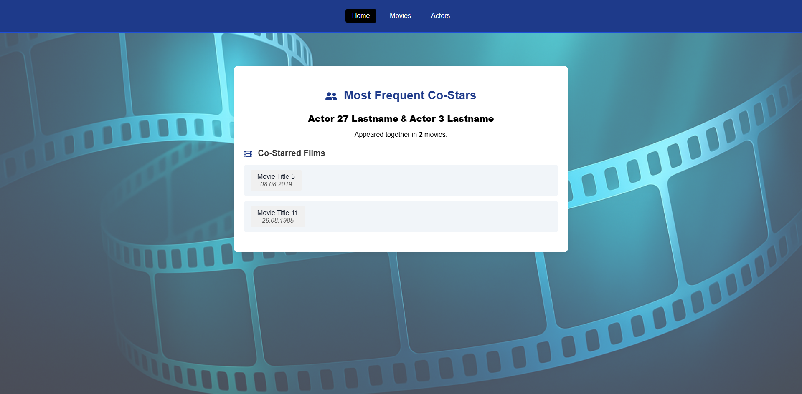
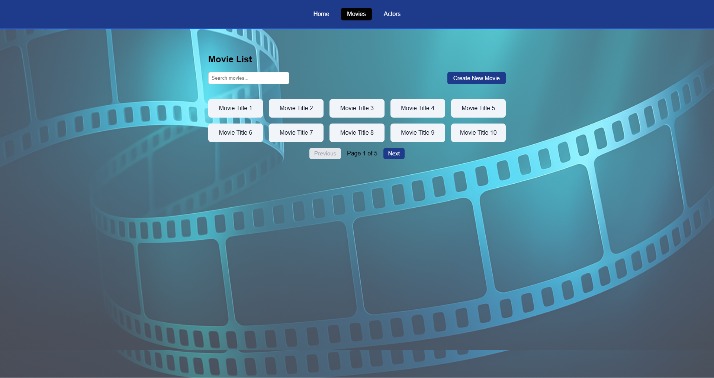

# Movie App

## Overview
Movie App is a React-based web application for managing actors, movies, and roles, and analyzing co-appearances of actor pairs.  
The app parses CSV files, validates data, and displays insights such as the most frequent co-star pair and their shared movies.

---

## Key Features

### **Data Management**
- Import actors, movies, and roles from **tab-separated CSV files**.
- **LocalStorage** persistence for all data changes.
- Add, edit, and delete actors, movies, and roles directly in the UI.
- **Edit & Delete functionality**:
  - **Movies**: Update movie title or release date directly from the movie modal, or delete the movie entirely.
  - **Actors**: Update actor name or birthdate from the actor modal, or delete the actor entirely.
  - Changes instantly update the analysis and saved data in LocalStorage.

### **Validation**
- Input validation for names, dates, and duplicates.
- Custom error messages for incorrect formats.
- Supports multiple date formats when importing CSV files.

### **Analysis**
- Displays the **top co-star pair** based on shared movie appearances.
- Clickable shared movie list opens a modal with movie details and related roles.
- Movies in the analysis view can be opened without navigating away from the page.

### **Accessibility**
- Clear error messages for wrong data formats.
- Empty state messages when no data is available.

---

## Getting Started

## Home Page

## Movies Page

## Actors Page

